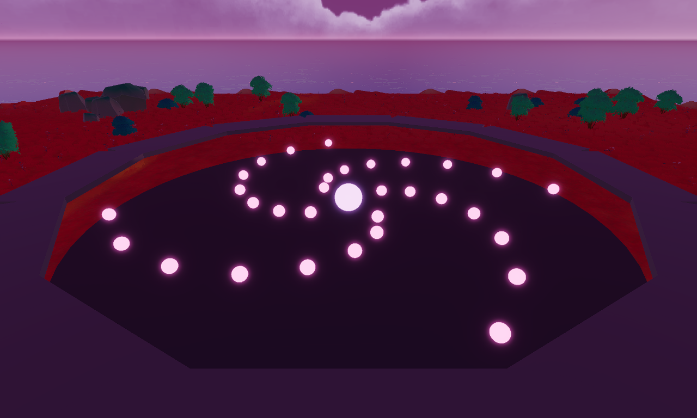

# Decentraland Experience Proposal

**Creator Success Program — Proposal Template (short GDD)**

| | |
|---|---|
| Experience name | |
| Studio / team name | |
| Date | |
| Contact (Discord + email) | |

---

## Before you start (read this, then delete it)

- This document should take you **a few focused hours**, not weeks. If a section is hard to answer, that section is telling you the design needs more thought. That is the point of the template.
- **Respect the word caps.** Short writing forces clear thinking. We can always ask for more detail later.
- **A rough sketch or greybox screenshot beats polished concept art.** We fund games, not documents. Do not spend time making this document pretty.
- **Anything playable is a bonus — and the more playable, the bigger the bonus.** You do not need one to apply, but it is the strongest signal you can send, in this order: a rough prototype of your core mechanic (any engine, even a web demo) is *good*; a playable core loop in SDK7 is *great*; a small vertical slice live in a World is *excellent*. One link like this outweighs pages of description — put it in the TL;DR.
- Write simple, direct English (B2 level). Your experience must also work for non-English speakers, so practice here.
- If you don't know something yet, write `TBD:` and how you plan to find out. **An honest gap builds more trust than a vague claim.** If it is something only a playtest can settle, park it in **Appendix A — Hypothesis Log** with the cheapest test that could prove you wrong.
- Every section starts with guidance in *italics*. Replace the guidance with your answers.
- Before writing, read **How the Creator Success Program Works** and **What Makes a Great Experience**. This template assumes you know both.

What we fund: **social-first, replayable, mobile-ready experiences with clear progression.** Program goal: **more than 20% of new players return within 7 days (D7 retention).**

---

## 0. TL;DR

*Fill this table last, after everything else. A reviewer reads it first.*

| | |
|---|---|
| **One-line concept** | |
| **Team & total hours/week** | e.g. "2 people, ~30h/week combined" |
| **Current status** | idea / sketches / greybox / core-mechanic prototype / playable core loop / vertical slice in a World — **link anything playable; playable evidence is the strongest plus in review** |
| **Live at end of Week 6** | one sentence: what a player can do in your World |
| **Requested round** | v1 |

---

## 1. The Hook

It's like NieR: Automata's bullet hell, but the arena is shared — you and every other avatar in the plaza survive the same pattern together.

---

## 2. First Session — written as "you"

You spawn on a neon-lit walkway ringing a sunken arena. Below, glowing orbs bloom outward in slow spirals, and a handful of avatars weave between them. A pulsing ring on the floor marks the drop-in point. `[HYPOTHESIS → H1-04]`

You drop in as a new wave starts — wide, slow arcs. You sidestep the first one; a low chime marks the near miss. Then an orb flashes blue as it closes on you — you press, and it ricochets back through the pattern, punching a hole the avatar beside you dives through.

Wave by wave the pattern tightens, and every deflect — yours and everyone else's — chips the yokai's glowing bar above the pit. Three waves in, the bar shatters and the yokai is banished; the arena rim lights up with the next round's name and a preview of its pattern — visibly denser.

The last thing you see before leaving: [OPEN — the Day-2 reason is designed in §4 at stage 2, then staged back into this beat.]

---

## 3. Core Loop

*Stage 2 — loop table resolved 2026-08-14. Three loop-structure claims are parked (H2-01, H2-02, H2-03), all testable in one greybox extension of the H1 build.*

| # | Step (verb) | What the player does | Why do it again? |
|---|---|---|---|
| 1 | READ | Watch the incoming bullet pattern and find the gap | Every wave draws a new pattern |
| 2 | WEAVE | Move your avatar through the gap | The gap never opens in the same place — patterns sweep and rotate, so every wave is a new route `[HYPOTHESIS → H2-03]` |
| 3 | DEFLECT | A timed press ricochets the flashing bullet wherever your camera points — aim is part of the verb (decided 2026-08-13) — clearing a hole in the pattern **for everyone in the arena** | Your deflect visibly helps the players around you — and it is the only thing that damages the yokai |
| 4 | SURVIVE | Outlast the wave; the next one starts tighter | Empty the yokai's life bar to banish it — the next round summons a denser yokai |

**Goal structure (decided 2026-08-14; risk confirmed real 2026-08-15):** each round summons a yokai with a visible life bar. Deflected bullets are the only damage; emptying the bar banishes it, and the next round's yokai attacks denser. The round is **bar-driven**: waves keep coming and tightening until the bar hits zero, with the bar sized so a competently-deflecting crowd banishes in about 3 waves — a crowd that deflects poorly gets a longer, denser round and slides toward the wipe, so bad play *is* the difficulty curve. Deflect is the win verb — the fiction already says why: you throw the yokai's own fury back at it. **Known break (H2-01 failed, owner probe, desktop, 2026-08-15):** under the current pattern law (spiral step with a ±7° drift), the bar makes camping the correct way to play — deflect damage is position-independent while threat density thins with distance from the emitter, so a near-still rim player banished three yokai to round 4 with a 70% measured camp fraction and zero knockouts. The goal structure therefore stands **only if** anti-camping becomes a pattern-design law that genuinely forces movement — that is `[HYPOTHESIS → H2-03]`, now load-bearing and blocking this claim; its test must also account for the 3-hit knockout rule (owner decision 2026-08-15, `decisions.md`), which made the occasional camping hit nearly free.

**Death rule (decided 2026-08-14):** a hit knocks you out for the rest of the current wave — you are thrown back onto the walkway to spectate, and you drop back in when the next wave starts. Your personal **clean streak** (waves survived without a hit) resets to zero; the group's round never rolls back. Ejected players watching from the rim are part of the design — they populate the walkway a newcomer sees in §2 and feed §5's bystander test.

**Reset rule (decided 2026-08-14):** if a wave ends with nobody left standing in the pit, the yokai wins — the haunting resets to round 1. The drop-in ring stays open mid-round, so the arena is always enterable, and the ramp self-corrects to the current crowd's skill: deep rounds die fast, so newcomers mostly arrive at low rounds. A session is therefore a **collective run** — "we got to round 7" — that ends when a wipe breaks the banishment chain. Solo at a dead hour this collapses to "every hit resets the run" — coherent for the genre, but §5's quiet-hour test must look at it.

**Roster mapping (decided 2026-08-14):** the yokai roster is grouped into difficulty tiers; each round summons a **random yokai from that round-band's tier**, preferring ones the pit has not seen today — never a fixed one-yokai-per-round ladder. Two runs to round 5 meet different yokai, so authored variety strengthens repetition without becoming its load-bearing source; the scrapbook (§4.3) fills breadth-first at low tiers while deep tiers stay rare, skill-gated pages; Great Haunting mega-yokai are pages too (attendance pages, not depth pages). The v1 roster slice is §9 arithmetic — deliberately unsized until §11's team hours exist.

- **One loop takes:** one wave ≈ 40 s — measured in the H1 greybox (2026-08-13), inside the 30–90 s band. One round = waves until the bar empties, tuned to ~3 waves + the rim's preview beat ≈ 2–2.5 min.
- **One session lasts:** one collective run to the wipe; target median 8–15 min. `TBD: measure median run length in the H2 greybox, then in the live funnel (§10).`
- **Why is the 10th repetition still fun?** Three named sources, all already designed: **other players** — the crowd is the variety: holes open where someone else aimed a deflect, the bar melts at crowd speed, every run has a different cast; **rising difficulty** — every banishment buys a denser yokai, so repetition climbs instead of looping flat; **skill expression** — the aimed deflect and the clean streak give mastery a visible ceiling. Authored per-yokai pattern variety is deliberately the garnish, not the answer — content gets consumed once (the v1 yokai count is a §9 scope decision). The claim is parked, not proven: the solo floor tests in the H2 greybox; the crowd source needs v1 testers. `[HYPOTHESIS → H2-02]`
- **Why the FIRST repetition feels good:** reading a wall of glowing bullets, finding the gap, and threading your whole avatar through it — with a deflect that punches a visible hole in the pattern. The verb held in the greybox: with no score, reward or goal attached, the owner voluntarily played 3 consecutive waves and quit by choice (H1-01 survived, owner self-test, desktop, 2026-08-13). Two conditions proved load-bearing and are now part of the verb: the deflect is **scarce** (1.5 s cooldown — free spam killed the weave entirely) and the telegraph is **honest** (exactly one bullet glows blue: the one E will send back, and only if its path would hit or graze you). Whether the verb pulls players who did not invent it is unmeasured — that is H1-04's fresh-eyes test. `[HYPOTHESIS → H1-01]` The deflect timing is fair on desktop — measured, not felt: 12/13 intended deflects landed (92% vs the ≥70% bar) on the aimed verb, and the owner could predict each landing before pressing (H1-02 validated 2026-08-13; the touch version is untested — mobile pending). Genre density actually runs on desktop — measured: 112 avg render FPS with 150 simultaneous glowing projectiles, zero hiccup frames, and the scene tick unchanged from 35-bullet load (H1-03 validated 2026-08-13; mobile untested — mobile pending). Pattern design is not FPS-constrained on desktop.

---

## 4. Why Players Come Back

*This is the section we grade hardest.*

*Hard fact about the platform: **Decentraland cannot send push notifications.** Nothing will remind a player that your experience exists. The reason to return must live in the player's own memory ("my crop is ready at 6pm", "the leaderboard resets Sunday") or in their friends ("my crew races every Friday").*

*A simple way to think about it: **Day 1 is bought with fun, Day 7 with appointments, Day 30 with friends.***

### 4.1 The Day-2 sentence

> "A player who enjoyed Day 1 comes back on Day 2 because last night's deepest round — *we got to round 7* — is sitting on this week's haunting board with their name on it, and it will not survive tonight's crowd unless they come defend it."

The mark decays toward the Sunday reset, so it is always time-anchored; defense-of-a-mark lives in the player's own memory, which is the only notification system the platform has. Built entirely from state the loop already produces — "deepest round reached" is the session's natural output, zero new systems. Presumes hook 1 in §4.3: the weekly small-league haunting board. `[HYPOTHESIS → H2-04]`

### 4.2 The Day-7 player

A Day-7 player has, by name: a **league rank tier** from Sunday's final standing, shown on the rim beside their name and over their head in the arena; a **lifetime personal best** (deepest round ever, never resets) standing next to their weekly mark; **1–2 Great Haunting charms** already hanging visibly on their avatar (§4.4); and a **scrapbook filling in** — x/N yokai revealed from silhouette, one for each yokai whose banishment they stood through (§4.3, hook 3). The skill is persistent too: they read patterns a wave earlier than they did on Day 1.

### 4.3 Your return hooks — pick at least two

| Hook | Why it works without push notifications |
|---|---|
| **Appointment timer** — something finishes, respawns or unlocks at a known future time | The player's memory is the notification ("ready at 18:00") |
| **Daily goals + streak** — rotating daily tasks, escalating reward track | Loss aversion; use milestone recovery, never punishing resets |
| **Weekly leaderboard reset / small leagues** — rank inside small groups, fresh start weekly | Near-zero content cost; automatic weekly event; deadline drives a surge |
| **Collection** — visible x/N progress toward a displayable reward | An unfinished set feels unfinished (proven effect); evergreen once shipped |
| **Recurring scheduled event** — e.g. every Friday 20:00 UTC | The event calendar is your real notification system (in-world + Discord) |
| **Team / crew obligation** — small persistent groups with shared goals | "My crew expects me" is the strongest known retention force |
| **Season track** — a free time-limited progress track, 6–8 weeks | Deadline + comeback moment at each new season; align with the program's cycles |
| **Async traces** — things players leave behind that others discover later | The world feels alive even at quiet hours; zero ongoing cost |

**Hook 1 — Weekly small-league haunting board.** Your mark is the highest round in which you were **standing in the pit when its yokai was banished** — present and alive, not spectating from the walkway. That keeps the mark personal even though the run is collective, and it cannot be farmed by camping (H2-03's pattern law refuses that). Leagues are small brackets (~20 players, grouped as they first place each week — exact size `TBD: settled by H2-04's league-size arithmetic`), never one global board: on a global board the top ten own it and everyone else stops looking. Resets Sunday 00:00 UTC; the arena rim shows your league, your mark, and the countdown. `[HYPOTHESIS → H2-04]`

**Hook 2 — The Great Haunting, Friday 20:00 UTC.** Once a week the arena summons a mega-yokai: one fixed, reusable round template — bigger bar, denser opening wave, and a week of warning on the rim. Being in the pit at its banishment is the point (what it pays is §4.4's long-term goal). One automated template, no host required — the event calendar is the platform's only real notification system, carried by the in-world rim countdown plus Discord. `[HYPOTHESIS → H2-05]`

**Hook 3 — The yokai scrapbook (collection).** A panel showing every yokai in the shipped roster, each a black silhouette until you have stood in the pit at that yokai's banishment — then it fills in, permanently. The unfinished page is the hook: the set visibly wants completing, and deep-round yokai make deep runs worth chasing beyond the board. The roster ambition is large (~30 yokai over the program's rounds — owner's call); the v1 slice is §9 scope arithmetic, and the panel only ever shows the shipped roster, so no slot can be a promise the build cannot keep. `[HYPOTHESIS → H2-06]`

### 4.4 The long-term goal

**The Exorcist wearable** — awarded for standing in the pit at **4 Great Haunting banishments**. Calendar-gated by construction: four Fridays is a month, and no grinding compresses it. Progress is stranger-visible *during* the climb, not only at the end — each attended banishment hangs a visible charm on your avatar in-scene (one attachment model, reused ×4), so a stranger sees 3/4 charms and asks. The finished wearable travels everywhere in Decentraland: the most retained players become the free marketing channel. Behind it sits the longer arc: completing the yokai scrapbook (§4.3) — season-scale, and it grows with each program round's content drop.

---

## 5. Social by Design

*Program requirement: playable alone, better with others. "Better with others" must be designed, not hoped for.*

- **What is better — not just possible — when 2+ players are present?** (group-scaled rewards, multiplayer-only moments, competition, an audience)

  [Your answer]

- **The quiet-hour test.** A player arrives alone at a low-traffic hour. What do they see and do so the world still feels alive — and how do they end up interacting with another player *by design, not by luck*? (spawn placement near activity, traces left by earlier players, social verbs a stranger can use on you in 2 seconds)

  [Your answer]

- **The bystander test.** What does someone understand by *watching* another player play? Visible gameplay is both your marketing and your tutorial.

  [Your answer]

- **Bring-a-friend.** What in the game makes a player invite someone? (invitation as gameplay, "both earn double", things you can only unlock together)

  [Your answer]

- **The memorable moment.** Describe one specific moment a player would screenshot or clip and share.

  [Your answer]

---

## 6. Mobile-First

*Mobile is not a port target — it is the primary design target. Build for touch first, scale UI up to desktop.*

**Every core-loop verb on touch.** Copy your verbs from Section 3:

| Core-loop verb | How it works with touch controls |
|---|---|
| | |
| | |

**UI plan.** *One or two sentences: how is your UI designed for a small screen first?*

[Your answer]

**Performance.** *Target: 60fps on recommended desktop hardware / 30fps on minimum hardware, with up to 20 players in the scene. What is your single biggest performance risk (asset weight? physics? effects?) and your plan for it?*

[Your answer]

**Desktop-only dependencies.** *Do you rely on any feature not yet available on mobile? (Check the Desktop vs Mobile Feature Gap tracker.) If yes: how is the design built so the feature can switch on later without a redesign?*

[Your answer]

---

## 7. World, Look & Story

**Story / world.** Neo-Tokyo's grid is haunted by digital yokai, and each round the arena summons one — its bullet pattern is that spirit's fury given light. You survive the haunting together with everyone in the pit; deflecting a bullet throws the yokai's own fury back at it.

**Visual direction.** Ghostwire: Tokyo (rain-slick neon shrine streets, yokai in a modern city) · NieR: Automata's glowing-orb bullet language (fat, slow, readable projectiles) · Akira's Neo-Tokyo night palette. Rendered as stylized PBR with baked lighting, consistent with Genesis Plaza quality. `[agent-decided — owner named the direction ("cyberpunk yokai"); references chosen to match it]`

**Required: at least one image.**

*Greybox screenshot from the H1-01 build (desktop Explorer, 2026-08-13): the sunken arena with its walkway ring, one spiral pattern mid-bloom around the emitter. Primitives only — the yokai art direction above is not yet built.*

---

## 8. Comparables — exactly two

| | Comparable A — `TBD: owner to name a second comparable (Decentraland if known, outside is fine) before submission` | Comparable B — NieR: Automata |
|---|---|---|
| What worked | | 3D bullet-hell patterns — slow, fat, glowing orbs readable in 3D space — fused with a Japanese sci-fi/cyberpunk mood. The one recognizable name that carries both the genre and the aesthetic of this pitch. |
| What didn't work | | Combat depth (perfect-dodge timing, weapon combos) and camera precision far beyond a small team's scope; that depth is not what made the bullet patterns memorable. |
| What we do differently | | We keep NieR's bullet language and strip its combat: no shooting, no combos — one shared arena where every avatar survives the same yokai's pattern together, and a single timed deflect that visibly helps everyone. Built for short sessions in a social world, not a 30-hour solo campaign. |

---

## 9. Six-Week Plan (v1 scope)

*Program milestones are fixed: **Week 2** — functional test version of the core loop (basic single-player and multiplayer working). **Week 6** — live in your own World, public repository delivered.*

| Week | What is playable / done |
|---|---|
| 1 — Prototype definition | |
| 2 — Core interaction test version | |
| 3 — Core systems refinement | |
| 4 — Playable prototype, final design direction (mobile playtest) | |
| 5–6 — Live testing and sign-off | |

**Not building in v1 — list exactly 3 things you are explicitly cutting.** *This is a realism check. "Nothing to cut" means the scope hasn't been thought through. Good cuts hurt a little.*

1.
2.
3.

**Standing non-goals — optional, 0–3 lines, each as `never X, because Y`.** *A cut is wanted-and-deferred — v2 may bring it back. A non-goal is identity through negation — "never a rage game, so death never rolls back progress" — no expiry, a pillar with a minus sign. Write one only if it has already refused something concrete: an idea, a mechanic, a comparable. A generic line ("never boring") refuses nothing. Leaving this empty is a legitimate answer.*

-

**Top risk + fallback.** *The one thing most likely to go wrong (technical or design), and your plan B. Naming risks raises our confidence in you — it never lowers it.*

[Your answer]

*Rule of three: anywhere you list content (levels, minigames, items), give at most 3 examples. Three shows variety; ten shows unscoped ambition.*

---

## 10. Success Criteria — what you will measure

*Progression to the v2 round depends on retention evidence. Decide now what evidence you expect to see.*

- **The 2–3 numbers you will watch from Week 1 of being live** *(examples: % of new players who complete the first goal; median session length; % of sessions where the player interacts with another player; % returning within 7 days)*

  [Your numbers]

- **Your first-session funnel** *(the steps you will instrument: spawn → first interaction → first reward → first goal complete → session end). If you can't name the steps, you can't fix the drop-offs.*

  [Your funnel]

- **Your pivot threshold.** *What result after 2 weeks live would make you change the design? What result would make you say "this hypothesis failed"? Agreeing on this now makes iteration decisions easy and fair.*

  [Your answer]

---

## 11. Team

*Hours per week matter more than credentials. Jam games, open call builds and mods all count as proof.*

| Person (name/handle) | Role in this project | Hours/week | Links to past work |
|---|---|---|---|
| | | | |
| | | | |

**Coverage check:** *who covers code (SDK7 / TypeScript), 3D & art, and design? Name any gap and your plan for it.*

[Your answer]

---

## 12. Deliverables & Declaration

**With the v1 round (6 weeks) we will deliver:** *(3–5 concrete bullets — things a player can do, not internal tasks)*

-
-
-

**Content & IP declaration.** *Confirm that all assets are original, properly licensed, or from open sources, and comply with Decentraland's Content Policy. List any third-party assets and their licenses.*

[Your declaration]

---

## Before you submit — self-check

- [ ] A stranger could repeat my hook after hearing it once
- [ ] The first 10 seconds need no reading, no tutorial, no NPC
- [ ] My Day-2 sentence names a concrete, time-anchored reason — not "it's fun"
- [ ] I chose at least 2 return hooks and explained how each works here
- [ ] I answered the quiet-hour test (world alive at low traffic)
- [ ] Every core-loop verb has a touch mapping
- [ ] My story section is 2 sentences or less
- [ ] I listed exactly 3 things I am NOT building
- [ ] There is at least one image (sketch/greybox is fine)
- [ ] All guidance text in italics is deleted

*What happens next: the Creator Success team reviews your proposal, may invite you to a short call, and responds with a decision or targeted questions. You get feedback either way.*

---

## Appendix A — Hypothesis Log

*Some of what you wrote above is a **decision** ("one loop takes 45 seconds"). The rest is a **claim** about how players will behave ("the 10th repetition is still fun", "they come back for the Sunday reset"). Claims belong here, written so that a test could prove them wrong.*

*This is a feature, not an admission. A claim with a test plan is the strongest thing in a proposal; a claim without one is the weakest. Reviewers read this table as evidence that you know which parts of your design are still unknown.*

**How to fill one row:**

- **IF / THEN** — falsifiable, in one sentence: *"IF the drop cycle is 45s, THEN 4 of 5 first-time players complete three cycles without being told what to do."* If you cannot describe what failure looks like, it is not a hypothesis yet — write it as `TBD:` in the section instead.
- **Source section** — which section above makes the claim, so a result knows what to go back and rewrite.
- **Cheapest killing test** — the least expensive thing that could prove it wrong: paper or arithmetic (no build needed) → desktop Explorer (the Creator Hub default — a greybox is minutes, not days) → mobile. Order the table by this column. Never spend an expensive test on a question a cheap one could answer.
- **Status** — `parked` (written down, not started) · `active` (test in flight) · `validated` (measured and held) · `survived` (you tested it yourself and the kill-check held; the full criterion was not measured — the expected v0 state) · `failed` (a result, not a mistake — keep it) · `deferred` (skipped on purpose, kept visible).
- **Tested on** — `desktop` / `mobile`. A touch-input or performance claim that only saw desktop stays *mobile pending* — the phone check costs minutes (Creator Hub → the dropdown next to Preview → Show QR Code for Mobile), so run it before you submit if you can.

*This table is **generated** from the experiment files in `design/<stage>/` — status comes from each filename, verdicts from inside the files. Do not edit the status column by hand: rename the file and regenerate.*

| ID | IF / THEN (falsifiable) | Source section | Cheapest killing test | Status | Verdict / date | Tested on |
|---|---|---|---|---|---|---|
| H1-01 | IF the core verb is weave-through-a-bullet-pattern plus a timed deflect, THEN the owner voluntarily replays ≥3 consecutive greybox waves with no score, reward or goal attached | §3 Core Loop | Desktop Explorer greybox, owner self-test, ~30 min build | survived | kill-check held: 3 voluntary waves, quit by choice (owner self-test) · 2026-08-13 | desktop |
| H1-02 | IF the deflect window is ≥0.4 s and bullets telegraph clearly, THEN the owner lands ≥7 of 10 intended deflects in a greybox wave | §3 Core Loop | Same greybox as H1-01, owner self-test (mobile-sensitive) | validated | 12/13 intended deflects (92%), aimed verb, kill-check held · 2026-08-13 | desktop — mobile pending |
| H1-03 | IF a wave renders ~150 simultaneous moving glowing projectiles, THEN the scene holds ≥60 fps in desktop Explorer on recommended hardware | §3 Core Loop | Instrumented desktop greybox, agent-measurable (mobile-sensitive) | validated | 112 avg render FPS at 150 projectiles, 0 hiccups · 2026-08-13 | desktop — mobile pending |
| H2-01 | IF the yokai's life bar makes deflect the win verb, THEN an owner self-test round still plays as weaving punctuated by deflects — the owner does not camp the 1.5 s cooldown near the emitter | §3 Core Loop | Extend the H1 greybox with a life bar + deflect damage; owner self-test, one round | failed | kill-check did not hold: deliberate near-still camping carried the run to round 4 (3 banishes, 70% camp, 0 knockouts) · 2026-08-15 | desktop |
| H2-02 | IF the greybox has the full loop structure (life bar, ramp, wipe reset, clean streak), THEN the owner voluntarily plays ≥10 waves across ≥2 runs in one sitting and quits by choice, not boredom | §3 Core Loop | Same H2 greybox build as H2-01, owner self-test (solo floor only — the crowd source needs v1 testers) | parked | | — |
| H2-03 | IF the pattern law is redesigned so gaps sweep AND threat reaches every radius, THEN a deliberate camping round — one 2.5 m spot, rim included, micro-adjustments allowed, under the 3-hit rule — ends in a knockout before the yokai is banished | §3 Core Loop (goal structure — load-bearing) | Same H2 greybox with the new pattern law; owner repeats H2-01's rim-camp probe, judged by the camping meter | active | | — |
| H2-04 | IF the weekly small-league haunting board shows each player's deepest round, THEN players who place a mark on Day 1 return on Day 2 at a visibly higher rate than players who never placed | §4.1 Day-2 sentence | League-size arithmetic on paper now; the behaviour claim needs the live v1 funnel (D2 return, placers vs non-placers) | parked | | — |
| H2-05 | IF the Great Haunting runs every Friday 20:00 UTC with a week of rim warning, THEN Friday-evening concurrency visibly spikes above the weekday baseline | §4.3 Hook 2 | Live v1 funnel — concurrency around Friday 20:00 vs weekday baseline; no cheaper rung exists for a calendar-behaviour claim | parked | | — |
| H2-06 | IF the scrapbook shows silhouette→revealed progress per yokai, THEN players with a partially filled page (≥3 revealed) return within 7 days at a higher rate than players with none | §4.3 Hook 3 | Reveal-pacing arithmetic on paper now (reveals per session — no yokai may be a wall); the behaviour claim needs the live v1 funnel | parked | | — |
| H1-04 | IF the spawn frames the arena mid-pattern below the walkway, THEN 4 of 5 first-time testers start dodging within 5 s without being told anything | §2 First Session | H1-01 greybox + 3–5 first-time testers (fresh eyes required) | deferred | deferred at stage-1 close — needs fresh eyes; v1 brings external testers · 2026-08-14 | — |
